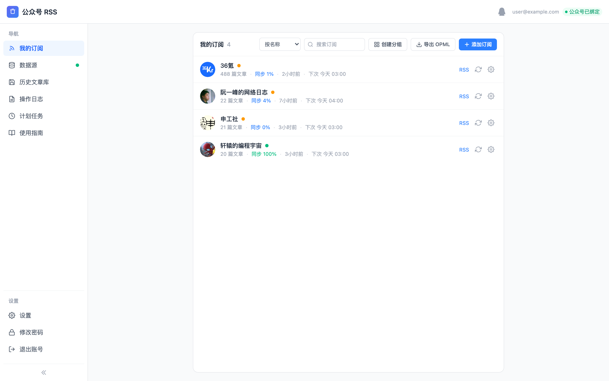
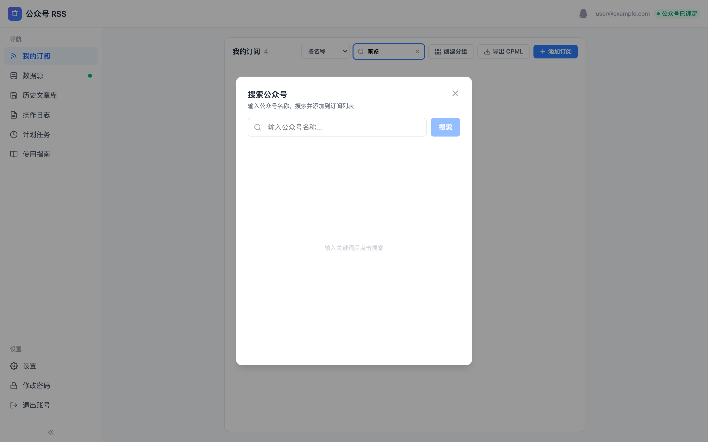
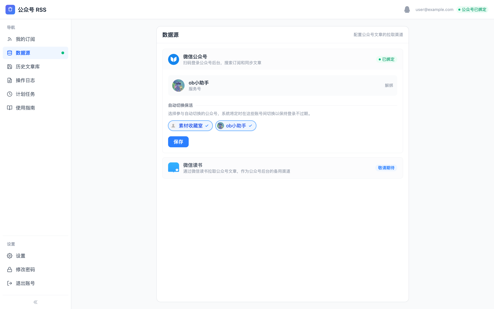
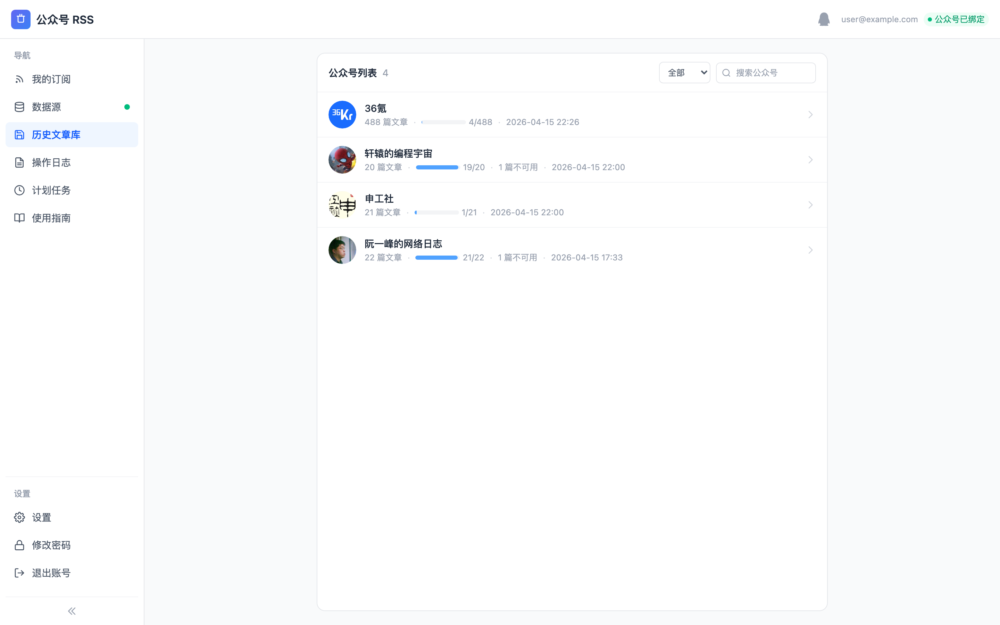
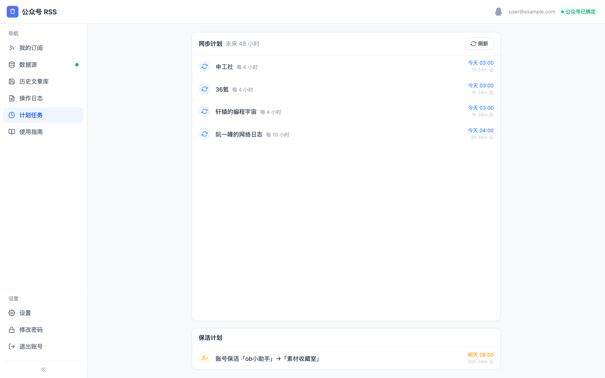
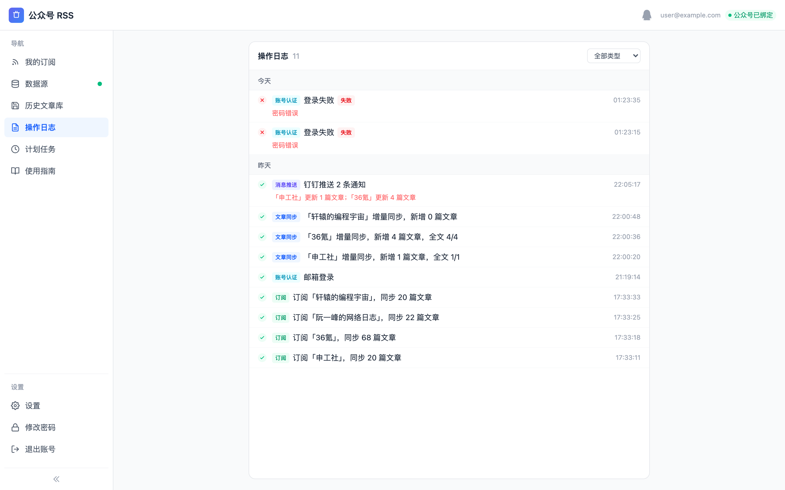

# MPRSS - 微信公众号 RSS 订阅服务

将微信公众号文章转换为标准 RSS 订阅源，支持任意 RSS 阅读器订阅。

## 功能截图

### 我的订阅

管理已订阅的公众号，查看同步进度、文章数量、下次同步时间。支持搜索、排序、分组、导出 OPML。

### 搜索公众号

通过关键词搜索微信公众号，一键添加到订阅列表。

### 数据源管理

绑定微信公众号后台，配置多账号自动切换保活。

### 文章库

浏览系统中已同步的所有公众号文章，查看全文抓取进度。

### 同步计划

查看未来 48 小时的同步计划和多账号保活切换时间表。

### 操作日志

记录所有操作：订阅、同步、配置变更、登录等，方便追溯。

## 核心功能

### 订阅管理

- **公众号搜索** -- 通过关键词搜索微信公众号，查看昵称、别名、头像、认证状态等信息
- **一键订阅** -- 选择公众号后自动生成独立的 RSS 订阅链接，支持 RSS 2.0 / Atom 1.0 / JSON Feed 1.1 三种格式
- **分组聚合** -- 将多个公众号合并为一个 RSS 源，统一管理和阅读
- **OPML 导出** -- 一键导出所有订阅为 `.opml` 文件，可导入其他 RSS 阅读器

### 文章同步

- **自动同步** -- 系统每小时自动检查并拉取最新文章
- **自定义频率** -- 支持为每个订阅源或分组单独设置同步间隔（1~24 小时）
- **手动同步** -- 随时触发即时同步，不必等待定时任务
- **断点续传** -- 同步中断后自动从上次位置继续，不会重复拉取
- **全文抓取** -- 异步抓取文章全文内容，RSS 中可直接阅读完整文章

### 多账号保活

- **自动切换** -- 配置多个微信公众号后台账号，系统每 2 天自动切换，延长登录有效期
- **无缝衔接** -- 切换过程中文章同步不中断，用户无感知

### 通知推送

- **多渠道支持** -- 支持 Webhook、邮件、钉钉三种通知渠道
- **新文章提醒** -- 有新文章时自动推送通知，附带文章标题和链接
- **异常告警** -- 同步失败、Token 过期等异常情况自动告警
- **定时汇总** -- 邮件通知支持每日定时汇总发送，避免频繁打扰

### 文章库

- **文章浏览** -- 浏览系统中已同步的所有公众号文章，查看全文抓取进度
- **全文阅读** -- 支持在线阅读已抓取全文的文章内容
- **全文抓取** -- 一键触发后台异步抓取文章全文，关闭浏览器不影响进度

## 使用流程

1. **注册账号** -- 通过邀请码 + 邮箱注册
2. **绑定公众号** -- 扫码登录微信公众号后台，授权系统拉取文章
3. **搜索订阅** -- 搜索感兴趣的公众号并订阅
4. **获取链接** -- 复制 RSS 订阅链接，添加到你喜欢的 RSS 阅读器
5. **自动更新** -- 系统定时同步新文章，阅读器自动获取更新

## RSS 订阅格式

每个订阅源支持三种标准格式，通过 URL 参数切换：

| 格式 | 参数 | 兼容性 |
|------|------|--------|
| RSS 2.0 | `?format=rss`（默认） | 兼容所有 RSS 阅读器 |
| Atom 1.0 | `?format=atom` | 现代阅读器推荐格式 |
| JSON Feed 1.1 | `?format=json` | 适合程序化消费 |

## 许可证

本项目为私有项目，暂不开放源代码。如有合作意向或问题反馈，请通过 Issue 联系。
